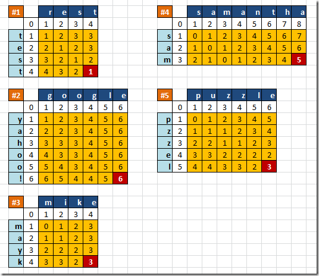

## Similarity Algorithm

## Edit Distance Based

### Hamming Distance
Hamming mesafesi bilgisayar bilimlerinde aynı uzunluktaki iki dizgi (string) arasında, birbirine dönüşmesi için gerekli olan yer değiştirme sayısını verir. Yani basitçe bir dizginin diğer dizgiden ne kadar farklı olduğunu gösterir.

100011101 <-> 100101101 = 2
düğün <-> düşün = 1
kuru <-> duru = 1
clone <-> drone = 2
patates <-> domates = 3
dolu <-> kedi = 4s

### Levenshtein Distance

rest kelimesinin test kelimesi ile olan yakınlığı bulunmaya çalışılmıştır. Aslına bakarsanız bu iki kelime arasında sadece 1 işlem yaparak sonuca ulaşılabilir. Bu işleme göre rest kelimesindeki r harfi yerine, t harfinin gelmesi yeterlidir. Matris içerisinde yer alan sayılar o andaki sütuna veya satıra kadar olan harf topluluklarının birbirleri ile eş düşmeleri için gerekli işlem sayılarını içermektedir.

google ve yahoo! kelimelerinin yakınlık hesabını göz önüne alalım. Normal şartlarda iki kelime içerisinde ortak olan 2 “o” harfi bulunmaktadır ancak yerleri farklıdır. Diğer harfler ise zaten birbirlerinde yoktur. Bu nedenle 6 işlemlik bir operasyon yapılması gerekmektedir.

Peki sayılar tam olarak nasıl yerleştirilmekte veya okunmaktadırlar? Hemen Samantha ile Sam’ in karşılaştırılmasını ele alalım. Şimdi 0 indisli olacak şekilde 1nci sütun ve 1inci satırı göz önüne alalım. 1nci sütunda “s” harfi ve 1nci satırda yine “s” harfi bulunmaktadır. Dolayısıyla o anki karşılaştırmada, her iki harfte aynı olduğunda bir işlem yapılmasına gerek yoktur. Dolayısıyla işlem maliyeti 0dır. Şimdi 2ncü sütuna ve 1nci satıra bakalım. 2nci sütuna kadar olan kısımda “sa“ hecesi oluşmuştur. Satır tarafında ise sadece “s” harfi bulunmaktadır. Dolayısıyla eşleştirme için satır kısmındaki “s” harfine bir de “a” harfinin eklenmiş olması gerekir. Ki bu da 1 işlem maliyeti olarak ifade edilmektedir.

- https://www.youtube.com/watch?v=-wZAIai1mWo

### Jaro-Winkler

## Token Based

### Jaccard Index
### Sorensen-Dice 

## Sequence Based

### Ratcliff-Obershelp Distance

### Jaro-Winkler

### References

- https://itnext.io/string-similarity-the-basic-know-your-algorithms-guide-3de3d7346227
- https://github.com/rasimserifbalkan/FuzzyString
- https://bilgisayarkavramlari.com/2008/08/05/hamming-mesafesi-hamming-distance/
- https://www.buraksenyurt.com/post/Levenshtein-Distance-Algoritmasi
- 