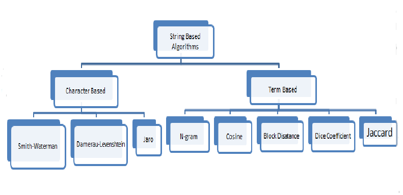

# Similarity Algorithms

## Edit Distance Based

### Hamming Distance
### Levenshtein Distance
### Jaro-Winkler

## Token Based

### Jaccard Index
### Sorensen-Dice 

## Sequence Based

### Ratcliff-Obershelp Distance

### Jaro-Winkler

### References

- https://itnext.io/string-similarity-the-basic-know-your-algorithms-guide-3de3d7346227
- https://github.com/rasimserifbalkan/FuzzyString